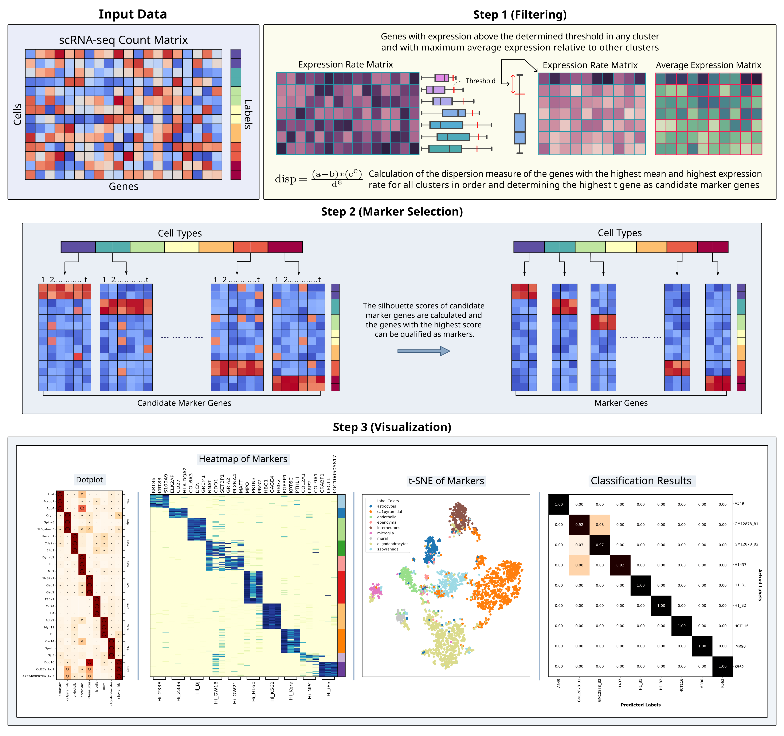

### scMAGS: Marker Gene Selection From scRNA-seq Data for Spatial Transcriptomics Studies



* scmags selects marker genes from scRNA-seq data that are exclusive to each cell type such that, selected marker genes are highly expressed in a specific cell type while lowly expressed in other cell types.

* See the [article](https://www.sciencedirect.com/science/article/abs/pii/S0010482523000999) for more detailed information.

### Installation

* * *

* scmags can be installed as follows:
```
$ pip install scmags
```

* Also the development verison of scmags can be installed from master branch of Git repository:

```
$ pip install git+https://github.com/doganlab/scmags
```
* See the [tutorial](https://scmags.readthedocs.io/en/latest/)  for more detailed information.

### Citation

* * * 

Please cite the following publication if you find scmags beneficial in your study:

Baran, Y., & Doğan, B. scMAGS: Marker gene selection from scRNA-seq data for spatial transcriptomics studies. *Computers In Biology and Medicine* (2023): 106634. https://doi.org/10.1016/j.compbiomed.2023.106634
